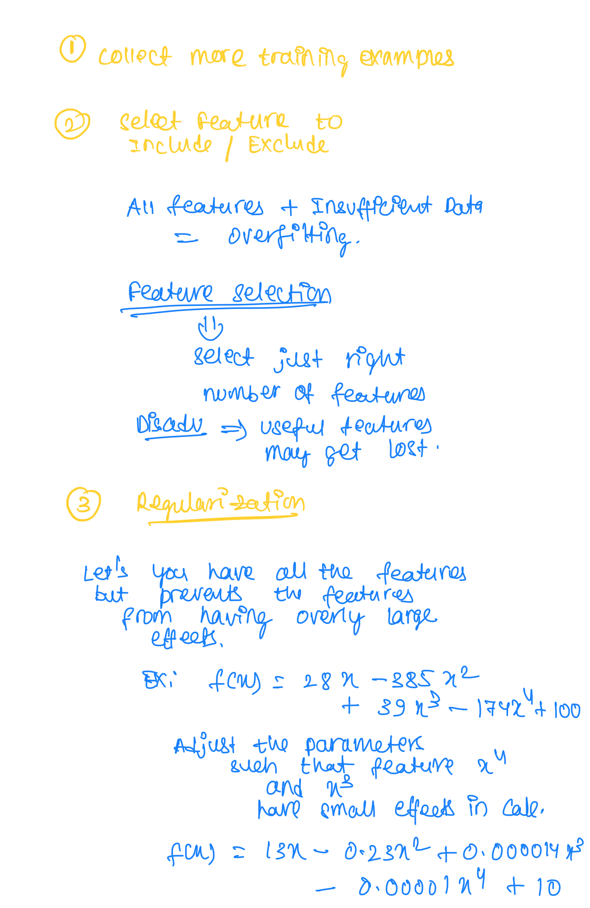

## Underfitting

- Does not fit training data well.
- Caused by too few paramaters to predict outputs.
- Also known as `High Bias`.

## Overfitting

- Fits the training set extremely well.
- But not able to predict the output well.
- Caused by too many parameters.
- Also known as `High Variance`.

## Generalization

- Fits training set pretty well.
- Approperiate amount of parameters.

[More Information](/Coursera-AndrewNg/Feature-Engineering/Regularization/Overfitting-and-Underfitting.pdf)

## Addressing Overfitting

[Cost Function with Regularization](/Coursera-AndrewNg/Feature-Engineering/Regularization/Cost-Function-With-Regularization.pdf)

[Regularised Linear Regression](/Coursera-AndrewNg/Feature-Engineering/Regularization/Regularised-Linear-Regression.pdf)

[Regularised Logistic Regression](/Coursera-AndrewNg/Feature-Engineering/Regularization/Regularised-Logistic-Regression.pdf)
