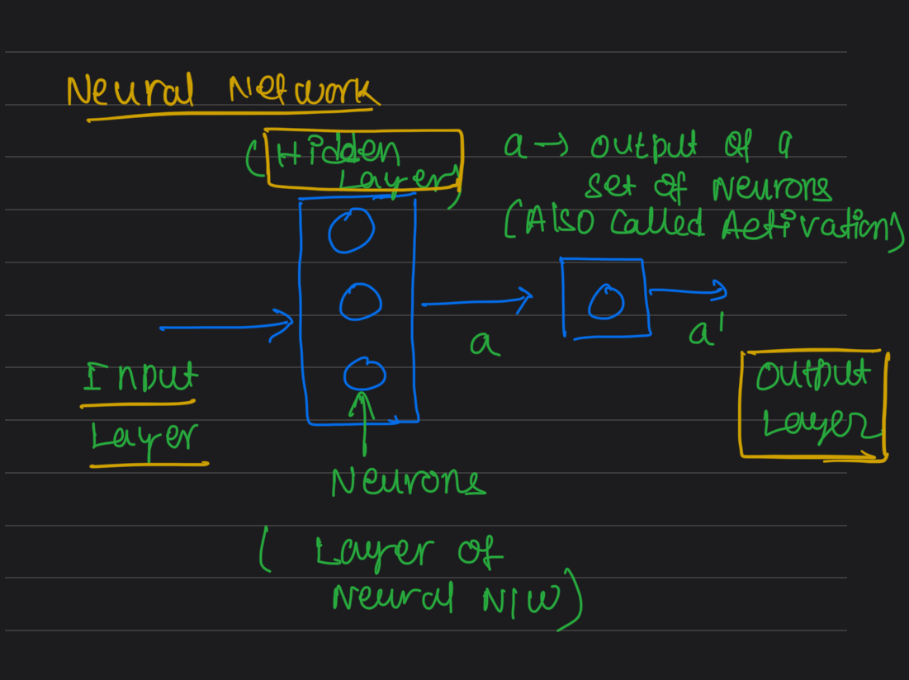
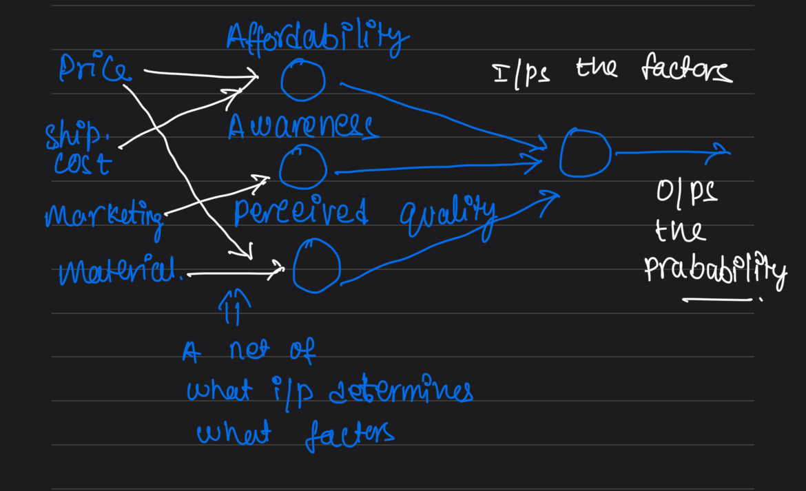

# Neural Network

### Scenario: Demand Prediction

Predict if the demand of T-Shirts are high or low based upon given features.

#### Find if the T-Shirts are top seller or not using price data.

-- Input Feature is X: Price of T-Shirt
-- Output is Top Seller Yes/No?

-- Hence, Binary Classification.
-- Activation function is Sigmoid.

-- Activation/output of Neuron (a) = f(x) = (1/(1+e^(-(wx+b))))

-- Can be represented as a Single Neuron model which takes Price(X) as Input, computes using formula and outputs a.

#### Find if the T-Shirts are top seller or not using multiple features.

-- Inputs:<ol><li>Price</li> <li>Shipping Cost</li> 
            <li>Marketing</li> <li>Material</li></ol>

-- Output: Probability of the T-Shirt to be top seller

-- Whether a t-shirt becomes top seller or not depends on few factors:
    <ol>
    <li>Affordability</li>
    <li>Awareness</li>
    <li>Perceived Quaity</li>
    </ol>

-- The inputs can determine how much the t-shirts are Affordable, Awared and Quality.

-- Hence, these factors can be one layer of the neural network model.

-- Single Neuron layer will be output layer which takes activations of 1st layer as input and give probability as output.

