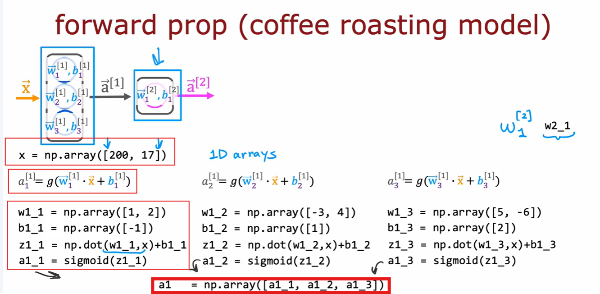
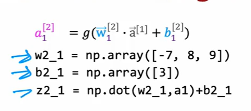
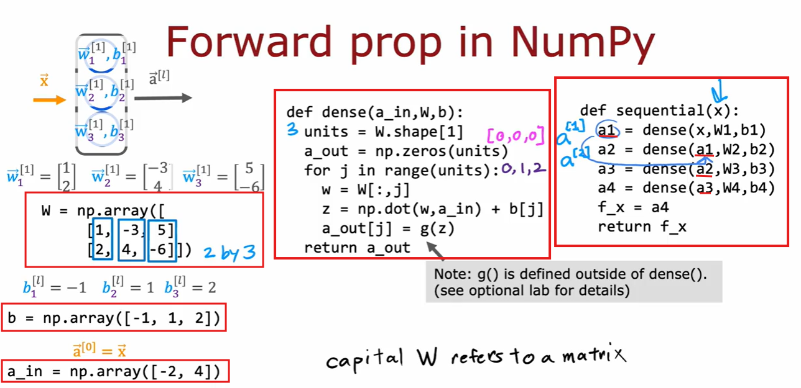

# Python Implementation of Neural Network Model

## Coffee Roasting

### Layer-I

- Let's take X vector as an array of [200, 17], where 200 is temperature and 17 is duration.
- Representation: <em>w1_2</em>: weight of 2nd neuron in the 1st layer.
- Now, we take some w and b values to train.
- We get activation of first neuron of 1st layer a1_1 is sigmoid of dot product of w1_1 and x + b1_1.

- Similarly, we can do this for all three neurons in the fist layer.

- Finally activation of first layer a1 = np.array([a1_1, a1_2, a1_3])

### Layer-II

## General Implementation of a forward propagation neural network model

- W is a N-Dimension Matrix. Here it is 2x3 matrix.
- Input vector x is 1-D matrix.

- Creating a Dense function which takes care of computation in a single layer.
- Sequential function takes care of the computation of whole model.