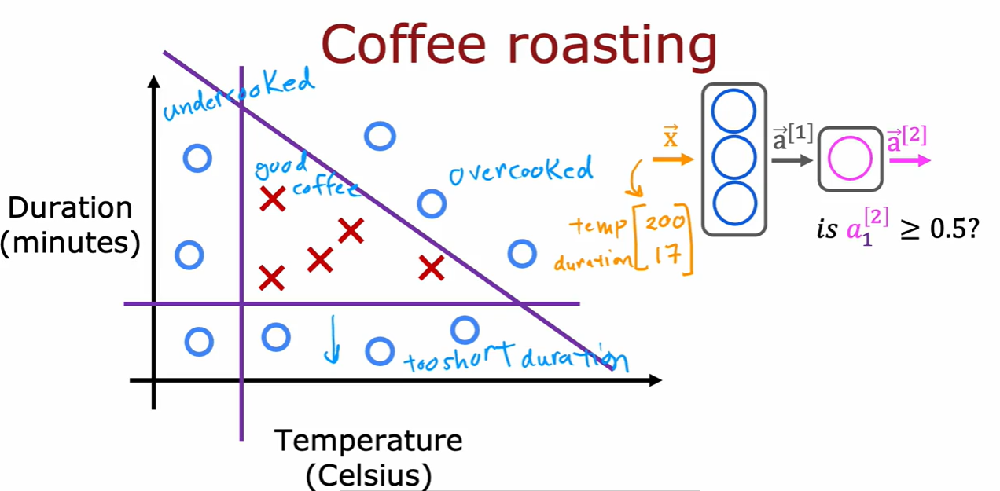
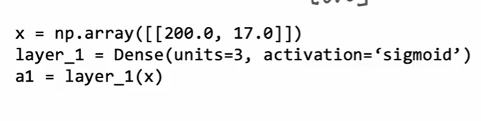
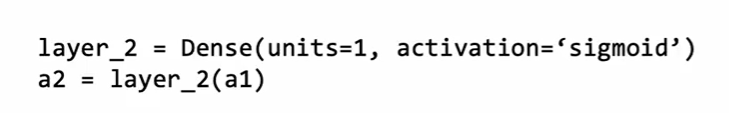
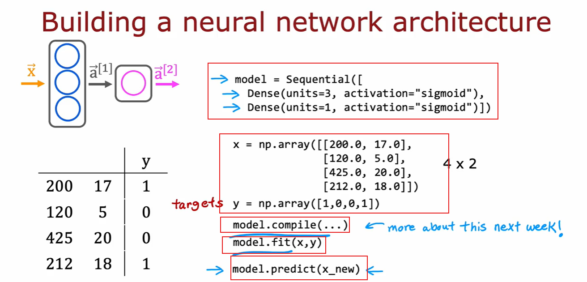

## How to implement a basic NN model using Tensorflow?

Let's take a coffee bean example.

- Feature Vector (x-vector) consists of temperature and duration of roasting.
- The model will predict if coffee is good or bad.



### First Layer



- <b>Dense</b>: Type of neural net library provided by tensorflow. It returns a function.
- Applying the returned function on vector X, we get a1 (activation of first layer)

- The output a1's will be tensorflow object. If we print it, we get something like: tg.Tensor([[0.2 0.7 0.3]], shape=(1, 3), dtype=float32)
- Then we have to do a1.numpy to get get the array: array([[0.2, 0.7, 0.3]], dtype=float32)

### Second Layer



- Similarly we get value of a2 which is the final activation of our model.
- Now, using the final activation value we can predict if coffee is good or bad.

```
    if a2 >= 0.5:
        yhat = 1
    else:
        yhat = 0
```

## Building the Neural Net Architecture




- We create a model by training different layers together.
- <b>Sequential</b>: A tensorflow function which trains a group of layer in sequential manner.
- Using <b>model.fit(x, y)</b>, we can train our model using existing set of data.
- Using <b>model.predict(x_new)</b>, we can predict outputs for any new data. 