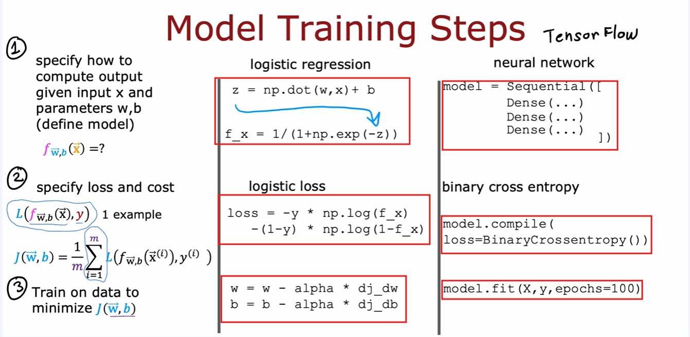

# Neural Network Model Training Steps

Below is comparision between a simple logistic regression imlementation and a neural network using logistic regression.

#### Step-1
- In Dense function, we provide logistic function.
- Using Sequential, we train each layer.

#### Step-2
- We provide loss function of our choice

