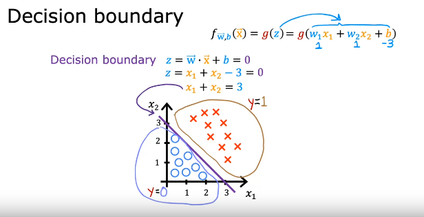

# Decision Boundary

- A threshold to predict if y-hat is 0 or 1.
- if f >= Threshold then y-hat = 1, else y-hat = 0.

## If we consider 0.5 as threshold

- If f >= 0.5, then g(z) >= 0.5.
- Since, g(z) is a sigmoid function,

        g(z) >= 0.5, when z >= 0

- Since, z = wx + b, therefore, if wx + b >= 0 ==> y-hat = 1

- Conversely, when wx + b < 0 ==> y-hat = 0

- Hence,

        Decision Boundary, is a line where z = 0

