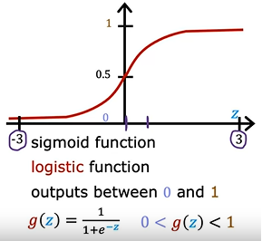
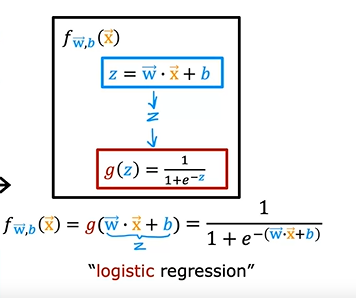

# Logistic Regression

- In Logistic regression, we have a group of data to predict.
- Or in case of binary, only two values to predict.

- Logistic Regression does this using a S-Shaped curve.
- Or also know as <em>Sigmoid Function</em>.

- The Y-Value for this function, is always 0 or 1.

## Sigmoid Function

- Also known as Logistic function.

- Always output between 0 and 1.

        i.e., the function g(Z) = (0, 1)

        and g(z) = 1/(1+e^-z) where e = 2.7

- When z = 0, g(z) = 0.5

## Logistic Regression Model

- In Logistic Regression Model, fw,b(x) = g(z), where

        z = w.x + b
        and Sigmoid function is g(z) = 1/(1+e^-z)

        Hence,
        fw,b(x) = g(w.x+b) = 1/(1+e^-(w.x+b))

- We can interpret logistic regression model as probability model.

- Example:

        If Model is predicting if cancer is malignant(1) or not(0)
        and timor size is X
        and model predicts value 0.7
        ==> This means that patient has 70% chance of cancer being malignant

Which means

    P(y=0) + P(y=1) = 1