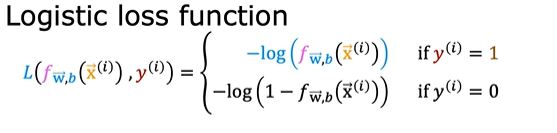

# Cost Function For Logistic Regression

- If we use the squared error cost function from Linear Regression, and substitute sigmoid for fw,b(x).
- We get a curve with lots of minima, i.e, Non-Convex Graph.
- Hence, this function is not suitable for Logistic Regression cost function.

## Building Cost Function

- Squared Error Cost Function is

        J(w,b) = 1/m(∑ᵢ=₁ₜₒₙ(1/2)(fw,b(x(i))-y(i))^2)

- We can write loss function 

        L = (1/2)*(Square of the given f(x) and predicted output)

- Logistic loss function

