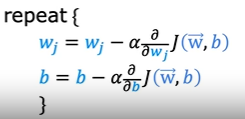
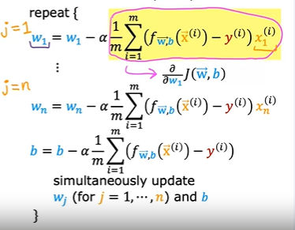

## Gradient Descent with Multiple-Variable Linear Regression

        w-vector = [w1, w2, ... wn]
        x-vector = [x1, x2, ... xn]
        b - Integer

        y-hat = fw-vector,b(x-vector) = w.x + b = dot-product(w, x) + b

        Cost Function = J(w-vector, x-vector) 
                      = (1/2m)(sum from i=1 to m(y-hat(i) - y(i))^2)
                      = (1/2m)(sum from i=1 to m((fw-vector(i),b(x-vector(i))) - y(i))^2)

Gradient Descent
----------------

- Putting the value of Cost function in the Gradient descent formula.
- And applying partial derivative:

- For j = n, and (n>=2)

