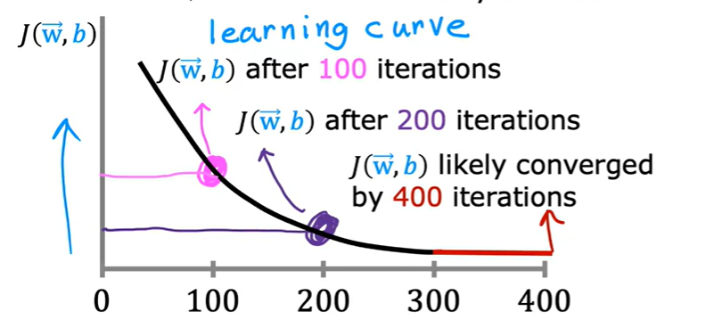

# How to check if Gradient Descent algorithm is converging for our model?

## Learning Curve

- Cost vs Iteration graph
- Plotting a graph after simultaneous updates of the w and b in the algorithm.

- After some iterations let's say 500, the graph gets flattened out then gradient descent is converged.

    