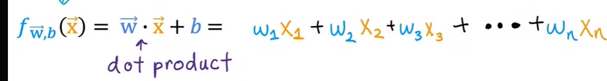

### Multiple Feature or Multiple Variable Linear Regression

- In Univariate Linear Regression, we were having only one feature(Input) to predict the output.

- In Multiple variable, we use multiple features to predict y-hat.

#### Notations

1. Xj(X1, X2, X3 .... Xn): Different Features.

2. n : Number of features.

3. X-vector(i) = Features of ith training example.

4. Xj(i) = Value of feature j in ith training example

        For 2nd training set (i=2), X-vector(2) = [1416 3 2 40 50]
        - for i=2 and j=4, i.e, for 4th feature of 2nd training set
            X4(2) = 40

#### Linear Regression With Multiple Feature Model

- Weight W will be different for each feature Xj

- W will become W-Vector for this model.

- b will remain as one single integer.

        (wx +b) will become (Dot-Product(W, X) + b)

    