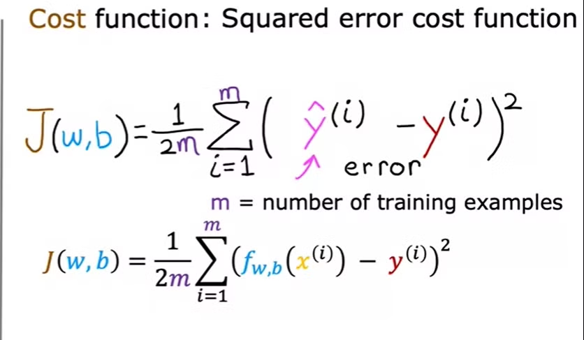
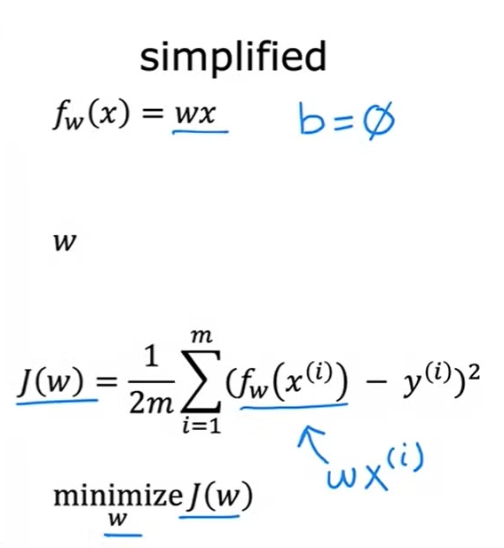
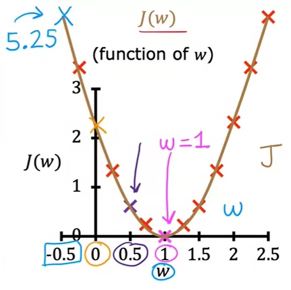
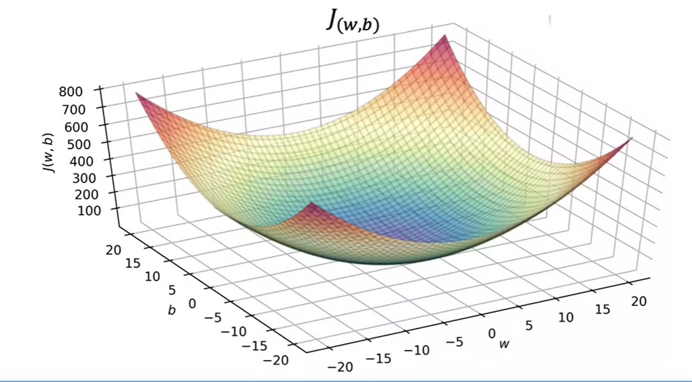
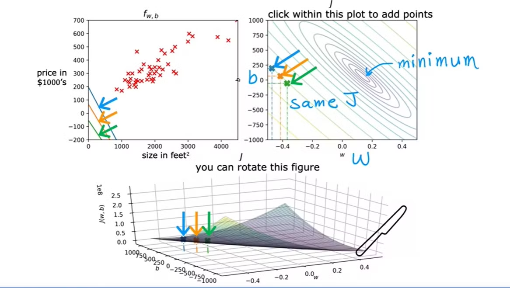

### Cost Function

- The cost function takes the prediction y hat and compares it to the target y by taking y hat minus y. 
- This difference is called the error, we're measuring how far off to prediction is from the target.

#### For Linear Regression in One Variable

    y-hat =  f(x) = w(x) + b, where w is the slope and b is y-intercept of the y-v-x graph.

    Cost Function: J(w, b) = (1/2m)(sum from i=1 to m(y-hat(i) - y(i))^2)

- Our goal should be to minimize this cost function.

#### Cost Function Intuition

1.  Keeping b = 0 (minimum)

- When we plot a graph of function where b is minimum, we get a J(w) vs w graph.
- We see that value of cost function is minimum when value of w is minimum.

- Hence, our goal should be to minimize w and b to make minimal cost function.

    

    

2. Keeping b != 0 (non-zero)

- When b is non-zero, the graph becomes (J(w) vs w vs b).  
- Cost function graph becomes a 3-D graph and to visualize this graph we use Contour Plots.
- In contour plot, We cut a 3-D surface by plotting constant z slices, called contours, on a 2-dimensional format.

- The new plot we get represents b vs w graph.
- Now for any w and b, if we plot a straight line from both axes, the place where they meet gives the value of J(w, b). (See Second Picture below).

- J(w, b) is minimum at the center of the contour plot b vs w.

