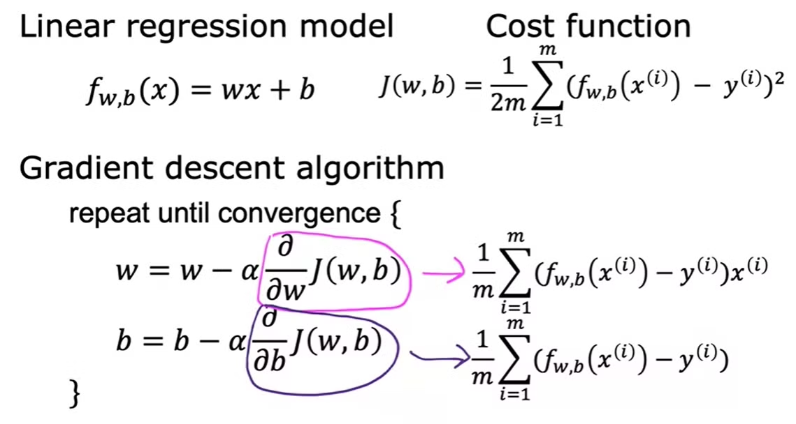

### Gradient Descent for Linear Regression Model

- Replace the cost function in the gradient descent formula.
- Find the derivative of it and we get the final formula.

***Note***

- We need to update both w and b simultaneously. 

- Linear Regression With one variable uses <em>squared error cost</em> function has only one local minimum.

