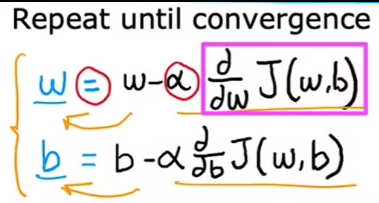

### Gradient Descent

- A machine learning algorithm to determine minimum values of a function.

- Idea is to change the value of w and b so that we reach near the minimum of the cost function J(w, b).

- Works by adjusting the parameters in the direction of negative gradient(i.e, descent) of the function.

- By taking the steps in the negative descent direction, we eventually reach the minimum value of the function.

### Gradient Descent Algorithm

- We take the parameter w and reduce it by a small amount which is alpha times derivative of cost function.

- Similarly, for parameter b we do the same thing.

        - Alpha is the learning rate.
        - We reduce the alpha times derivative of cost function until the convergence.

***Notes:***

- <u>***Point of Convergence***</u>: When values of w and b doesn't changes much on repeating the descent algorithm.

- <u>***Simultaneous Update***</u>: Both w and b should be updated simultaneously. This means that <em>we should not update b with the updated value of w. We can make use of temp variables and then updated w and b at the end of steps.</em>

     

## Gradient Descent Intuition

### 