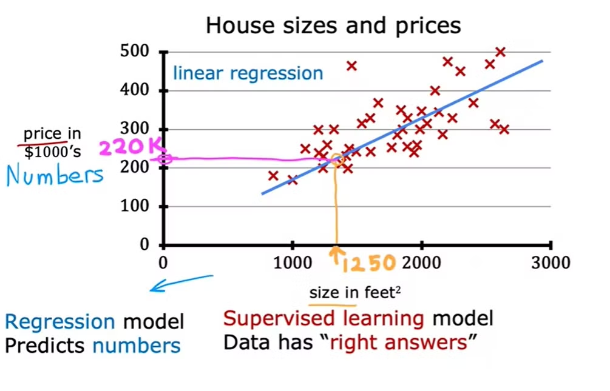

### Linear Regression with one variable

- Consider a dataset which has x data inputs and y outputs.
- We can plot or visualize a graph of y-vs-x.
- Now, if we put a straight line to the graph, i.e, (y = wx + b), then we can find out output y-hat based on any new values in dataset x.

- This is called Linear regression with one variable.

