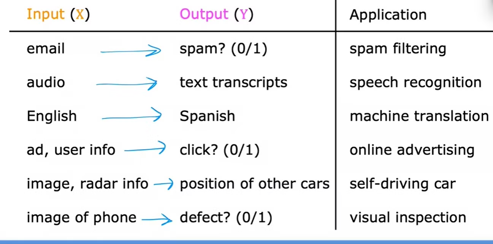

### What is Supervised Machine Learning?

    Supervised machine learning or more commonly, supervised learning, refers to algorithms that learn x to y or input to output mappings. 
    
    The key characteristic of supervised learning is that you give your learning algorithm examples to learn from.

    The correct label y for a given input x, and is by seeing correct pairs of input x and desired output label y that the learning algorithm eventually learns to take just the input alone without the output label and gives a reasonably accurate prediction or guess of the output.

### Types of Machine Learning

1. Regression: 

    - Predicts a number 
    - Has infinitely possible outputs.
    - Ex: Housing prices based on different features.

2. Classfication:
    
    - Predicts categories
    - Has small number of possible outputs.
    - Ex: Spam detection

