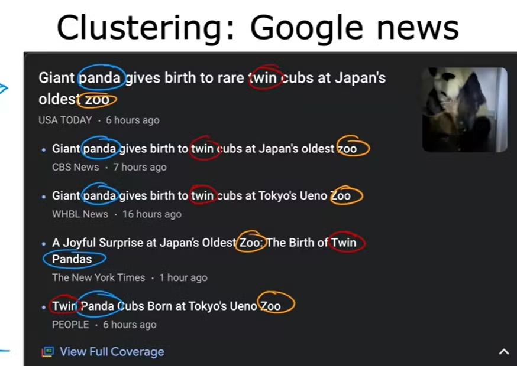

### What is unsupervised learning?

- Given data that isn't associated with any output labels y. 
- Our job is to find some structure or some pattern or just find something interesting in the data. 
    
- This is unsupervised learning, we call it unsupervised because we're not trying to supervise the algorithm.

- Data only comes with inputs x, but not output label y.

- ***Algorithms job is to find some strucutre in the data.***

- Ex: Given the relationship between tumor size and age, we can determine that large tumor size + old age has higher chance of cancer than small tumor size + young age.

    - This is called clustering.

#### Clustering

    - Grouping similar data.
    - Determing groups or cluster based on similarity.
    - Ex: Recommendations of News articles based on current article read.

    
#### Anomaly Detection

    - Find out unusual data points/unusual events.
    - Ex: Fraud detection in the financial system.

#### Dimensionality Reduction

    - Take big datasets and compress it.
    - Minimizes data loss due to compression.
